 

 

> **APIHub**: A searchable catalog of public APIs with live health checks, a try-it playground and an AI app builder.

 

 

## Screens

Animated illustrations of the real screens (redrawn as vector graphics for this showcase).

 <b>Home</b>

 <b>Explore</b>

 <b>API page</b>

 <b>Playground</b>

 <b>Status</b>

 

## Tech stack

## How it works (high level)

- **Catalog:** public APIs are collected from directories and each API's own documentation, then re-checked regularly.
- **Search:** keyword search combined with meaning-based (vector) search, filtered by real auth / HTTPS / CORS data.
- **Health:** scheduled checks record uptime and latency for every monitored API; failures are shown, not hidden.
- **Playground:** requests go through an allow-listed, SSRF-safe proxy so you can try APIs straight from the browser.
- **AI:** *Build My App* turns a plain-English idea into matched, verified APIs plus starter code, and a **public MCP server** (`/mcp`) lets AI assistants search the catalog.

## About this repository

This repository is a **showcase** of APIHub: a README, screenshots and diagrams only. The source code is private.
You can use the live project at **[apishub.dev](https://apishub.dev)**.

Built by **[Sushant Kumar](https://www.linkedin.com/in/sushant-kumar-bb067b128/)** · [GitHub profile](https://github.com/Sush-Singh)
